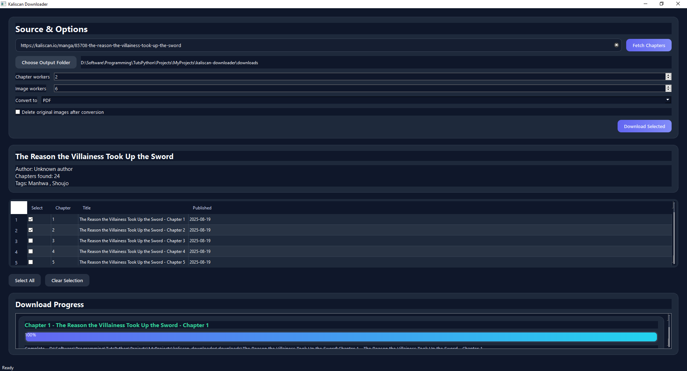

# Kaliscan Manga Downloader

[](https://www.riverbankcomputing.com/software/pyqt/)
[](https://playwright.dev/)
[](https://typer.tiangolo.com/)

A powerful and flexible downloader for the Kaliscan manga website, featuring both a rich graphical user interface (GUI) and a command-line interface (CLI). Scrape manga metadata, download chapters, and convert them to PDF or CBZ formats with ease.

This project is hosted at [https://github.com/Yui007/kaliscan-downloader](https://github.com/Yui007/kaliscan-downloader).

## Features

-   **Dual Interface**: Choose between a user-friendly GUI or a scriptable CLI.
-   **Manga Scraping**: Fetch manga details, including title, author, tags, and chapter lists.
-   **Flexible Downloading**: Download all chapters, a specific chapter, or a range of chapters.
-   **Concurrent Downloads**: Parallel downloads for both chapters and images to maximize speed.
-   **Format Conversion**: Automatically convert downloaded chapters to PDF or CBZ.
-   **Cleanup**: Option to delete original image files after conversion.
-   **Interactive CLI**: A guided prompt-based workflow for the command line.

## GUI Usage

The graphical interface provides an intuitive, point-and-click experience for downloading manga.



### Steps:

1.  **Launch the GUI**:
    ```bash
    python main.py
    ```
2.  **Fetch Chapters**:
    -   Paste the Kaliscan manga URL into the "Source & Options" input field.
    -   Click **Fetch Chapters**. The application will scrape the manga details and populate the chapter table.
3.  **Select Chapters**:
    -   Use the checkboxes in the table to select the chapters you want to download.
    -   Use the **Select All** and **Clear Selection** buttons for bulk actions.
4.  **Configure Options**:
    -   **Output Folder**: Click "Choose Output Folder" to specify where the downloads should be saved.
    -   **Workers**: Adjust the number of concurrent chapter and image workers to balance performance and resource usage.
    -   **Conversion**: Choose a conversion format (`PDF` or `CBZ`) from the dropdown. Select "None" to keep the original images. Check the box to delete the source images after conversion.
5.  **Download**:
    -   Click **Download Selected**. The progress of each chapter will be displayed in the "Download Progress" section.

## CLI Usage

The command-line interface is ideal for scripting, automation, or users who prefer a terminal-based workflow.

### Installation

1.  **Clone the repository**:
    ```bash
    git clone https://github.com/Yui007/kaliscan-downloader.git
    cd kaliscan-downloader
    ```
2.  **Set up a virtual environment**:
    ```bash
    python -m venv .venv
    source .venv/bin/activate  # On Windows, use: .venv\Scripts\activate
    ```
3.  **Install dependencies**:
    ```bash
    pip install -r requirements.txt
    ```
4.  **Install Playwright browsers**:
    ```bash
    playwright install chromium
    ```

### Commands

All commands are run through `main.py` with the `--cli` flag.

**1. Scrape Manga Info**

Fetch and display manga metadata and the full chapter list.

```bash
python main.py --cli scrape <URL>
```
*Example:*
```bash
python main.py --cli scrape "https://kaliscan.io/manga/the-reason-the-villainess-took-up-the-sword"
```

**2. Download Chapters**

Download one or more chapters with various selection methods.

-   **Download all chapters**:
    ```bash
    python main.py --cli download --url <URL> --all
    ```
-   **Download a single chapter by number**:
    ```bash
    python main.py --cli download --url <URL> --chapter <NUMBER>
    ```
    *Example:*
    ```bash
    python main.py --cli download --url <URL> --chapter 5
    ```
-   **Download a range of chapters**:
    ```bash
    python main.py --cli download --url <URL> --range <START-END>
    ```
    *Example:*
    ```bash
    python main.py --cli download --url <URL> --range 10-15
    ```

**3. Interactive Mode**

Launch a guided, prompt-based workflow that walks you through the scraping and downloading process.

```bash
python main.py --cli interactive
```

### Download Options

The `download` command accepts several options to customize the process:

-   `--output, -o`: Set the target download directory (default: `downloads/`).
-   `--chapter-workers`: Number of concurrent chapter downloads (default: 2).
-   `--image-workers`: Number of concurrent image downloads per chapter (default: 6).
-   `--retries`: Retry attempts for failed image downloads (default: 3).

## Requirements

-   Python 3.8+
-   See `requirements.txt` for all Python package dependencies.
